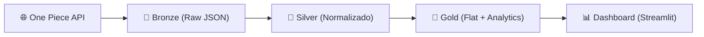
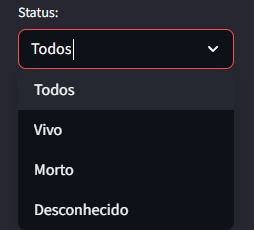
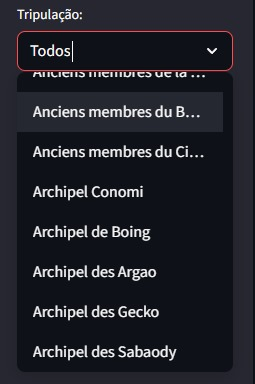
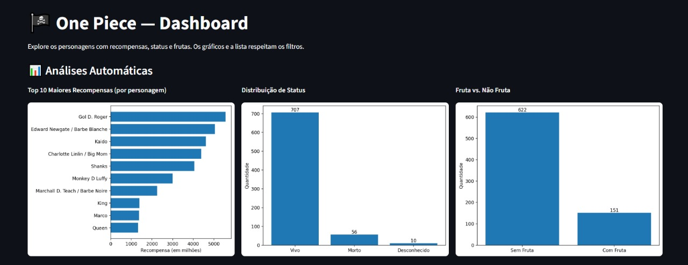
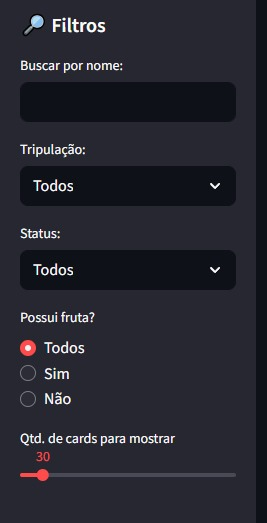

# 🏴‍☠️ One Piece Data Pipeline — Medallion Architecture

Projeto de **engenharia de dados** baseado no universo de *One Piece*, usando a arquitetura em camadas **Medallion (Bronze → Silver → Gold)** com **Apache Airflow** para orquestração e **Streamlit** para visualização.

---

## 📂 Arquitetura

🏗️ Camadas

Bronze: coleta dados da One Piece API
 e salva em JSON bruto.

Silver: normaliza os dados em CSV/Parquet, limpando e padronizando colunas (nome, recompensa, tripulação, fruta, status etc.).

Gold: gera duas saídas:

Flat → tabela limpa e enriquecida.

Analytics → métricas agregadas (ranking, totais, médias, estatísticas de frutas).

Dashboard: aplicação em Streamlit que mostra personagens, recompensas, tripulações e frutas, com filtros e gráficos.

🚀 Tecnologias

Orquestração: Apache Airflow

Processamento: Python (Pandas, NumPy)

Armazenamento: CSV / Parquet (datalake local)

Visualização: Streamlit + Matplotlib

📂 Estrutura de Pastas

ONEPIECE_MEDALLION/
│
├── dags/                     # DAGs do Airflow (Bronze, Silver, Gold)
│   ├── onepiece_bronze_dag.py
│   ├── onepiece_silver_dag.py
│   └── onepiece_gold_dag.py
│
├── datalake/
│   ├── bronze/               # Dados brutos (JSON)
│   ├── silver/               # Dados normalizados (CSV / Parquet)
│   └── gold/                 # Dados analíticos (Flat + Analytics)
│
├── dashboard/
│   ├── app.py                # Dashboard em Streamlit
│   └── prints/               # Prints do dashboard usados no README
│
├── requirements.txt          # Dependências do projeto
└── README.md                 # Documentação

▶️ Como Rodar o Projeto

Clone o repositório:

git clone https://github.com/seu-usuario/onepiece_pipeline.git
cd onepiece_pipeline

Crie e ative um ambiente virtual:

python -m venv .venv
source .venv/bin/activate   # Linux/Mac
.venv\Scripts\activate      # Windows

Instale as dependências:

pip install -r requirements.txt

Inicie o Airflow:

airflow db init
airflow scheduler -D
airflow webserver -D -p 8793

Acesse http://localhost:8793

Rode o Streamlit (dashboard):

streamlit run app/app.py

📸 Prints

📸 Prints do Dashboard

**Filtro por Status**

**Filtro por Tripulação**

**Dashboard com Gráficos**

**Painel Completo de Filtros**

📌 Próximos Passos

Adicionar integração com banco de dados (Postgres/MySQL) em vez de datalake local.

Incluir API externa de imagens para enriquecer os cards dos personagens.

Publicar o dashboard no Streamlit Cloud para acesso público.

✍️ Desenvolvido por Takeshy Takatsu como projeto de portfólio em Engenharia de Dados.
